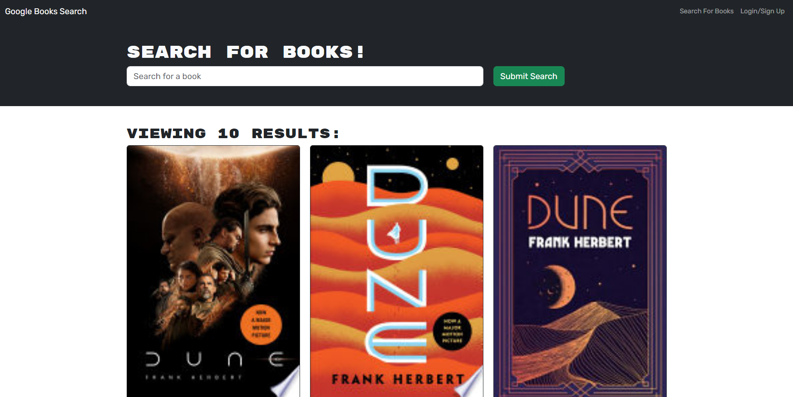

# Book Search Engine

## Table Of Contents

- [Description](#description)
- [Installation](#installation)
- [Technologies](#technologies)
- [Screenshots](#screenshots)
- [Links](#links)

## Description

Book Search Engine allows you to search for books and save them to your profile. You can also delete books from your profile. This application was built using the MERN stack and GraphQL. You are able to create an account and login from the top right navbar. This application utilizes the Google Books API to search for books. The application is deployed on Heroku.

## Installation

1. Clone the repository
2. Run `npm install` to install dependencies
3. Run `npm run develop` to start the server

## Technologies

Technologies used in this application:

- [Google Books API](https://developers.google.com/books)
- [React](https://reactjs.org/)
- [MongoDB](https://www.mongodb.com/)
- [Material UI](https://material-ui.com/)
- [GraphQL](https://graphql.org/)
- [Apollo Server](https://www.apollographql.com/)
- [npm](https://www.npmjs.com/)
- [Node.js](https://nodejs.org/en/)
- [Express.js](https://expressjs.com/)
- [bcrypt](https://www.npmjs.com/package/bcrypt)
- [JWT](https://jwt.io/)
- [Heroku](https://www.heroku.com/)
- [MongoDB Atlas](https://www.mongodb.com/cloud/atlas)

## Screenshots

## Links

- [GitHub Repository](https://github.com/Badermah/bookSerachEngine)
